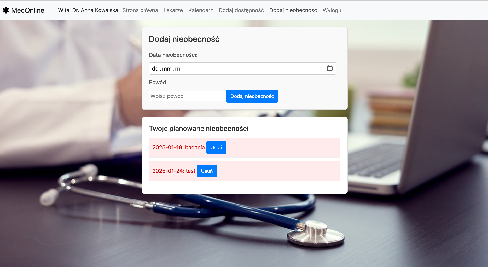
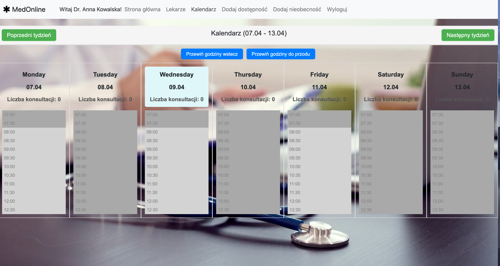

# 🏥 MedOnline – Online Medical Consultations

**MedOnline** is a web application designed for seamless online medical consultations between patients and healthcare providers. The platform allows users to book appointments, chat with doctors, and manage their medical history—all from the comfort of their home.

## 🚀 Getting Started

### Prerequisites

- [Node.js](https://nodejs.org/) (v16 or higher recommended)
- [Angular CLI](https://angular.io/cli) installed globally

### Installation

1. Clone the repository:

   ```bash
   git clone https://github.com/your-username/medonline.git
   cd medonline/medonline_project

2. Install dependencies:

    ```bash
    npm install

3. Start the development server:
    ```bash
    npx ng serve

4. Open the app in your browser:
    ```bash
    http://localhost:4200/
    

## 🛠️ Built With

- **Angular** – Frontend framework  
- **TypeScript**, **RxJS**, **SCSS**
- **Firebase** – Realtime database and authentication

## 📁 Features

- Patient registration and login  
- Browse and book consultations  
- Medical history and records
- Declare availability
- Inform about urgent schedule changes


## 🖼️ App overview

### 🏠 Main Page


> The homepage provides an overview of available features and access to login and registration.

---

### 🚫 Declare Unavailability


> Doctors can mark specific time slots as unavailable directly from their dashboard.

---

### 📅 Book Appointment


> Patients can browse available doctors and schedule consultations easily using the booking interface.
